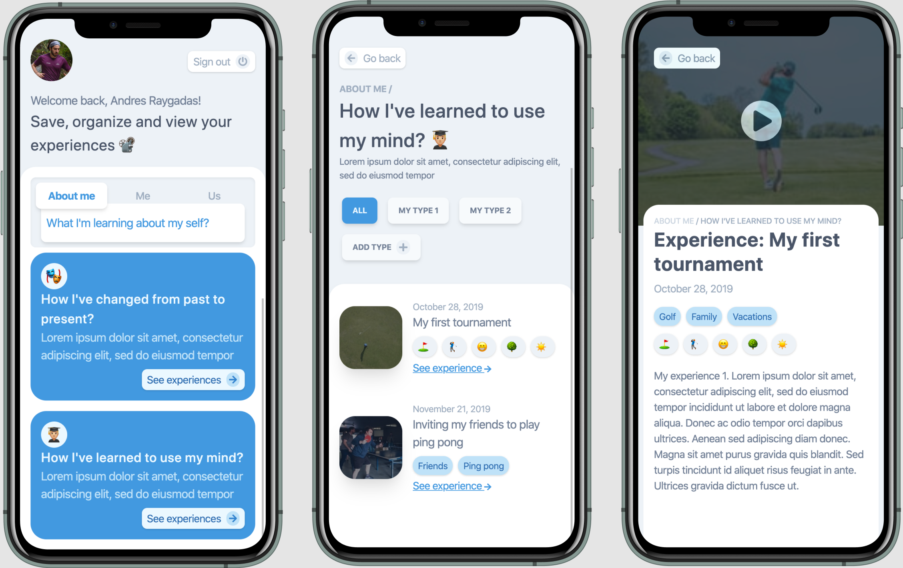

# UI of an experience management system made for people with autism



## How to use

### Run the dev version

Execute [`npm run dev`] with [npm](https://nodejs.org/) installed. For example:

```bash
npm run dev
```

### Run the build version
**Note: the current version was not deployed to production**

To create the production build, execute [`npm run build`] with [npm](https://nodejs.org/) installed. For example:

```bash
npm run build
```

Then start the build with [`npm run start`]. For example:

```bash
npm start
```

## Dependencies

This version was build using:

- [Next JS](https://nextjs.org/docs)
- [TailwindCss](https://tailwindcss.com/)
- [Firestore](https://firebase.google.com/docs/firestore/?hl=es-419)
